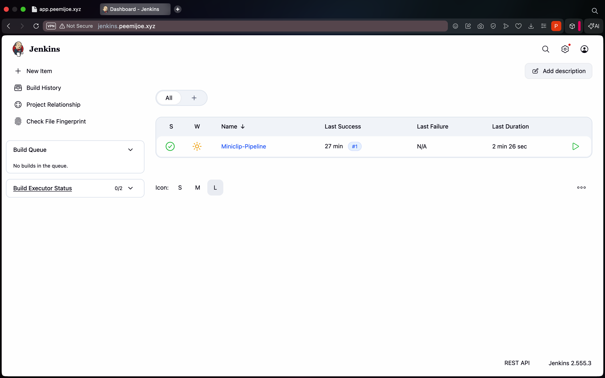
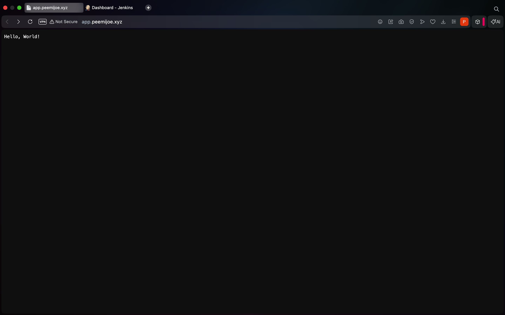

# Broken Cloud Pipeline

[](https://www.terraform.io/)
[](https://aws.amazon.com/)
[](https://www.jenkins.io/)

A deliberately flawed cloud deployment pipeline on AWS (eu-central-1) built with
Terraform, Jenkins, and Bash. The infrastructure is fully functional end-to-end; exactly three subtle, documented flaws are embedded to be identified and fixed during peer review.

---

## Architecture Overview

Traffic enters through Route 53 health checks, which monitor two Application Load
Balancers sitting in the public subnets of two peered VPCs. Every actual workload —
ECS clusters, EC2 container hosts, task containers — lives in the private subnets
and is never directly internet-reachable.

```
Internet
    │
    ▼ HTTPS:443
┌─────────────────────────────────────────────────────────┐
│  VPC: 10.40.0.0/16  (eu-central-1)                     │
│  ┌──────────────────────────────────────────────────┐   │
│  │  Public subnets: 10.40.0.0/24, 10.40.1.0/24     │   │
│  │  ALB (app) — open to all via HTTPS               │   │
│  └──────────────────────────────────────────────────┘   │
│  ┌──────────────────────────────────────────────────┐   │
│  │  Private subnets: 10.40.10.0/24, 10.40.11.0/24  │   │
│  │  ECS cluster — 2 × t3.micro EC2 hosts            │   │
│  │  2 × infrastructureascode/hello-world containers  │   │
│  └──────────────────────────────────────────────────┘   │
└─────────────────────────────────────────────────────────┘
         ▲ VPC Peering (10.40.0.0/16 ↔ 10.41.0.0/16)
         │ Jenkins deploys to app VPC via this link
┌─────────────────────────────────────────────────────────┐
│  VPC: 10.41.0.0/16  (eu-central-1)                     │
│  ┌──────────────────────────────────────────────────┐   │
│  │  Public subnets: 10.41.0.0/24, 10.41.1.0/24     │   │
│  │  ALB (Jenkins) — HTTPS, WAF restricts to PT only │   │
│  └──────────────────────────────────────────────────┘   │
│  ┌──────────────────────────────────────────────────┐   │
│  │  Private subnets: 10.41.10.0/24, 10.41.11.0/24  │   │
│  │  ECS cluster — 2 × t3.micro EC2 hosts            │   │
│  │  1 × custom Jenkins container (Docker CLI + AWS CLI) │ │
│  └──────────────────────────────────────────────────┘   │
└─────────────────────────────────────────────────────────┘

Shared services (all in eu-central-1):
  ECR   — image registry for app and Jenkins images
  S3    — access logs (ALB), container logs (ECS), pipeline logs (Jenkins)
  CloudWatch — log groups, HTTP 5xx alarm, daily cost alarm
  SNS   — alert topic with email subscription
  IAM   — ECS task execution role + EC2 container host instance profile
  WAF   — regional Web ACL geo-restricting Jenkins ALB to Portugal
```

> Note on billing alarm: AWS's `EstimatedCharges` metric is only published to
> `us-east-1` at the platform level — it cannot be read from any other region.
> The `aws.us_east_1` provider alias in `providers.tf` exists solely for this
> one CloudWatch alarm. Every other resource in this project is in `eu-central-1`.

---

## File Splitting Standard

Files are split **by resource type / concern**, not by VPC or environment. This
means every file owns one domain (networking, security, compute, observability)
across both VPCs, rather than duplicating the full stack per VPC. The trade-off:
cross-VPC resources like peering routes live in `network.tf` rather than inside
either VPC file, which keeps each file's surface area small and easy to audit.

| File | Owns |
|---|---|
| `versions.tf` | Terraform version constraint, required providers, commented-out S3 backend |
| `main.tf` | Module calls only — vpc_app, vpc_jenkins, ecs_app **(FLAW 1)**, ecs_jenkins |
| `providers.tf` | `aws.us_east_1` alias for billing alarm only |
| `variables.tf` | All root input variables |
| `locals.tf` | All computed/derived values — CIDRs, AZ list, name prefix |
| `network.tf` | VPC peering connection and peering routes in private route tables |
| `security.tf` | Security groups, NACLs, WAF Web ACL and ALB association |
| `alb.tf` | Both ALBs, target groups, HTTPS listeners |
| `ecr.tf` | ECR repositories and lifecycle policies |
| `iam.tf` | ECS task execution role, EC2 host role, pipeline policy, instance profile |
| `s3.tf` | Logging bucket, public access block, encryption, bucket policy |
| `cloudwatch.tf` | Log groups, HTTP 5xx alarm, daily cost alarm |
| `sns.tf` | Alert topic and email subscription |
| `route53.tf` | Route 53 health checks for each ALB |
| `outputs.tf` | Root outputs — DNS names, ECR URLs, cluster IDs, SNS ARN |

Modules follow the same pattern internally. `modules/vpc/` is a thin wrapper
around `terraform-aws-modules/vpc/aws` so the root can call it identically for
both VPCs with no duplication. `modules/ecs_service/` is the reusable compute
module that creates the ECS cluster, task definition, service, launch template,
ASG, and capacity provider — called once for the app and once for Jenkins.

---

## Design Decisions

### 1. Region: eu-central-1 (Frankfurt)

All infrastructure is deployed to Frankfurt as required. Frankfurt was chosen for
its low latency to Portugal (the Jenkins geo-restriction target), its full support
for all required services (ECS, WAF, ALB, ECR, SNS), and its compliance with EU
data-residency expectations. The single exception is the CloudWatch billing alarm,
which AWS forces to `us-east-1` because that is the only region where the
`EstimatedCharges` metric is published.

### 2. Two VPCs with separate CIDRs

The application (10.40.0.0/16) and Jenkins (10.41.0.0/16) are isolated in
separate VPCs rather than separate subnets in one VPC. The separation enforces
a blast radius boundary: a misconfiguration in the Jenkins VPC cannot affect the
application's routing table, NACLs, or security groups. VPC peering is then used
to allow only private-subnet-to-private-subnet traffic for deployments,
while the public subnets (and their ALBs) remain fully isolated from each other.

Using separate /16 blocks leaves room for future subnet expansion in either VPC
without renumbering the other. The /24 subnets (256 addresses each) are
deliberately over-provisioned relative to current ECS task counts so no
re-subnetting is needed as the project grows.

### 3. Reusable ECS module

A single `modules/ecs_service/` module handles both the application and Jenkins
deployments. This satisfies the requirement for a reusable module while keeping
the two deployments identical in structure. Differences (image, port, task size,
desired count, docker socket mount) are all variables, so the module has no
conditional logic. The alternative — two separate resource blocks in root — would
have caused ~150 lines of duplicated HCL that would need to be kept in sync manually.

ECS on EC2 was chosen over Fargate because t3.micro falls within the AWS free
tier; Fargate has no free tier and would incur per-vCPU/per-GB charges from the
first task. The trade-off is that we must manage the EC2 launch template, ASG,
and capacity provider ourselves — which the module encapsulates.

### 4. t3.micro EC2 instances (2 per cluster)

Two instances per cluster allows the ECS scheduler to spread tasks across
availability zones (one task per host), giving basic fault tolerance without
leaving the free tier. A single instance would be a single point of failure. Three
or more would exceed the free-tier 750-hour monthly allowance. The minimum and
maximum of the ASG are fixed at 2 so no auto-scaling events can accidentally spin
up billable capacity.

### 5. ALB for both clusters

ALBs were chosen over NLBs because the WAF geo-restriction requires an Application
Load Balancer — WAF can only be associated with ALB (Regional scope) or CloudFront.
Both ALBs terminate TLS at port 443 using ACM-managed certificates, enforcing the
HTTPS-only inbound requirement without managing certificate lifecycle manually.

### 6. WAF for Jenkins geo-restriction (Portugal only)

Security groups cannot filter by country, so a WAFv2 Regional Web ACL was added
to the Jenkins ALB. The ACL's default action is `block`; a single rule with
`geo_match_statement { country_codes = ["PT"] }` allows traffic. This is simpler
and more maintainable than maintaining a list of Portugal IP CIDR ranges in a
security group, which would need regular updates as ISP allocations change.

### 7. Network ACLs aligned with security groups

NACLs enforce the HTTPS-only inbound rule at the subnet boundary (defense in
depth). Public subnet NACLs permit inbound 443 and return-traffic ephemeral ports
(1024-65535) only. Private subnet NACLs restrict inbound to VPC-internal CIDRs
and the peered VPC CIDR, blocking all unsolicited inbound from the internet.
Because NACLs are stateless, ephemeral ports must be explicitly allowed for
established TCP connections to complete — all four NACLs carry this rule.

### 8. Single shared S3 bucket for all logs

One bucket with path prefixes (`alb/`, `ecs/`, `pipeline/`) is simpler to manage
and cheaper than three separate buckets. Bucket-level encryption (AES256) and
public access block apply uniformly. The bucket policy grants write permission to
the regional ELB log-delivery account (ALB access logs), the ECS task execution
role (container logs), and the EC2 host role (Jenkins pipeline logs — ECS
bridge-mode containers inherit the host instance profile, not the task execution
role).

### 9. CloudWatch log groups with 7-day retention

Seven days is long enough to debug a failed deployment but short enough to
avoid meaningful storage cost on the free tier. CloudWatch Logs charges per GB
ingested and stored; a 7-day retention cap ensures logs roll off automatically.

### 10. SNS email subscription

SNS was chosen over direct email via SES because SNS integrates natively as a
CloudWatch alarm action without additional configuration. The email subscription
requires a one-time confirmation click after `terraform apply` — this is an AWS
constraint documented in `sns.tf`. Both the 5xx alarm and the cost alarm publish
to the same topic to minimise subscription management.

### 11. ECR lifecycle policies

App images use **MUTABLE** tags so the pipeline can overwrite `:latest` on every
build — the ECS task definition is pinned to `:latest` and `force-new-deployment`
must pick up the freshly pushed image. Jenkins images are also MUTABLE (upstream
`lts` tag is updated in place). Both repos cap stored image count (10 for app,
5 for Jenkins) to prevent unbounded ECR storage growth.

### 12. Terraform file splitting by resource type

Splitting by resource type (one concern per file) was chosen over splitting by
VPC because:
- Most resources in this project have exactly two instances (one per VPC), so
  per-VPC files would each be half the length of the corresponding type file.
- Reviewers looking for "all security group rules" find them in one place
  (`security.tf`) rather than two VPC files.
- The reusable module pattern means both VPCs share one ECS definition file
  anyway — per-VPC files would be inconsistent.

### 13. No Terraform remote backend

The `backend "s3"` block in `versions.tf` is commented out. State is stored
locally, which is fully functional for a single operator. The trade-off is that
concurrent `terraform apply` runs from two machines will corrupt state with no
lock table to prevent it. The S3 bucket provisioned by `s3.tf` can host the state
file in a `terraform/` prefix once a DynamoDB lock table is added and the backend
block is uncommented.

### 14. Custom Jenkins image (Docker/Dockerfile.jenkins)

The upstream `jenkins/jenkins:lts` image does not include Docker CLI or AWS CLI,
both required by the pipeline stages. A custom image built from `Dockerfile.jenkins`
adds both tools and ensures the `jenkins` user is in the `docker` group matching
the host's docker GID (994 on the ECS-optimised Amazon Linux 2 AMI). The image
is pushed to ECR and referenced by the Jenkins ECS task definition via `:lts` tag.

---

## The Three Intentional Flaws

Exactly three flaws are embedded. Each is subtle enough that the pipeline runs
end-to-end without error, but each causes a measurable negative side-effect.

### Flaw 1 — Terraform: ECS task CPU over-allocated (main.tf)

**Location:** `main.tf`, `module "ecs_app"` block

**What it does:** The `task_size` for the application ECS task is set to
`{ cpu = 1024, memory = 512 }`. The `infrastructureascode/hello-world` container
serves a static page and needs at most 256 CPU units. Requesting 1024 units
reserves 4× the necessary CPU on each t3.micro host (which has 2048 units total),
leaving only 1024 units free — enough for just one more task rather than three.
This wastes half the available compute on every host in the app cluster.

**Why it does not break functionality:** The task still starts, registers with the
ALB target group, and serves traffic normally. ECS schedules it successfully
because 1024 CPU units fit within the host's 2048-unit budget. With `desired_count
= 2` and 2 EC2 hosts, one over-allocated task lands on each host and both run
fine. The only observable effect is wasted CPU capacity and reduced headroom for
future tasks.

**Fix:** Change `task_size = { cpu = 1024, memory = 512 }` to
`task_size = { cpu = 256, memory = 512 }` in the `module "ecs_app"` block in
`main.tf`.

---

### Flaw 2 — Pipeline: excessive S3 log archiving (Jenkinsfile)

**Location:** `Jenkinsfile`, Build image / Push to ECR / Deploy to ECS stages

**What it does:** Each stage redirects its command output to a `.log` file
(`build.log`, `push.log`, `deploy.log`) and uploads it to S3 via `aws s3 cp`,
in addition to the output already captured by Jenkins' own console log. Three
S3 `PutObject` calls per build, with no lifecycle policy on the `pipeline/`
prefix, means log objects accumulate indefinitely. A busy CI pipeline can generate
thousands of objects per month with no expiry.

**Why it does not break functionality:** The build, push, and deployment steps all
succeed regardless. The S3 uploads use `--quiet`, so upload failures do not
surface as pipeline failures (which is itself a secondary issue). The only effect
is inflated S3 storage and PUT request cost.

**Fix:** Remove the `aws s3 cp build.log`, `aws s3 cp push.log`, and
`aws s3 cp deploy.log` lines from the three stages, or add an S3 lifecycle rule
on the `pipeline/` prefix to expire objects after 30 days.

---

### Flaw 3 — Script: redundant health check calls (scripts/verify_health.sh)

**Location:** `scripts/verify_health.sh`, lines after the polling loop

**What it does:** After the `while true` polling loop exits with a confirmed
HTTP 200 response, the script performs two additional identical `curl` calls to
the same URL. These serve no diagnostic purpose — the loop has already proved
liveness. Each extra call adds approximately 2 seconds of latency per pipeline
run and produces duplicate request entries in the ALB access logs and CloudWatch
request metrics.

**Why it does not break functionality:** The pipeline health-check stage passes
because the two extra curls also return 200 and the script exits 0. No deployment
decision is affected.

**Fix:** Remove the two `curl` calls and the comment block below the line
`echo "Performing redundant secondary health checks..."`.

---

## Pre-Commit Setup

```bash
pip install pre-commit detect-secrets
pre-commit install
# Update the baseline after adding a file that intentionally contains a non-secret
# that trips a detector:
detect-secrets scan > .detect-secrets.json
pre-commit run --all-files
```

The four hook groups and their purposes:

| Hook repo | What it checks |
|---|---|
| `pre-commit/pre-commit-hooks` | YAML/JSON syntax, line endings, trailing whitespace |
| `antonbabenko/pre-commit-terraform` | `terraform fmt`, `terraform validate`, tflint |
| `bridgecrewio/checkov` | Security and compliance rules across all .tf files |
| `Yelp/detect-secrets` | Credential/secret strings against the `.detect-secrets.json` baseline |

---

## Deployment

### Prerequisites

- Terraform >= 1.5.0
- AWS CLI configured for `eu-central-1`
- An ACM certificate in `eu-central-1` covering your app and Jenkins domains
- Docker (for building and pushing images)

### Steps

```bash
# 1 — initialise providers and modules
terraform init

# 2 — review what will be created (~50 resources)
terraform plan \
  -var="alert_email=you@example.com" \
  -var="acm_certificate_arn=arn:aws:acm:eu-central-1:<account-id>:certificate/<id>"

# 3 — apply (takes ~8 minutes; NAT gateways and ALBs are slowest)
terraform apply \
  -var="alert_email=you@example.com" \
  -var="acm_certificate_arn=arn:aws:acm:eu-central-1:<account-id>:certificate/<id>"

# 4 — confirm the SNS subscription email AWS sends to alert_email

# 5 — build and push the custom Jenkins image (includes Docker CLI + AWS CLI)
ECR_JENKINS=$(terraform output -raw jenkins_ecr_repository_url)
REGISTRY="${ECR_JENKINS%%/*}"
aws ecr get-login-password --region eu-central-1 \
  | docker login --username AWS --password-stdin "${REGISTRY}"
docker build -f Docker/Dockerfile.jenkins \
  --build-arg DOCKER_GID=994 \
  -t "${ECR_JENKINS}:lts" .
docker push "${ECR_JENKINS}:lts"

# 6 — build and push the app image
ECR_APP=$(terraform output -raw app_ecr_repository_url)
docker build -f Docker/Dockerfile -t "${ECR_APP}:latest" .
docker push "${ECR_APP}:latest"

# 7 — note outputs for Jenkins credential store
terraform output
```

### Jenkins Credentials Required

After the first `terraform apply`, create these credentials in Jenkins
(Manage Jenkins > Credentials > System > Global credentials > Add Credential,
type: Secret text):

| Credential ID | Value | Source |
|---|---|---|
| `ecr-registry-url` | ECR registry hostname only (no repo path) | `terraform output app_ecr_repository_url` — strip everything from `/cloud-app` onward |
| `log-bucket-name` | S3 bucket name | `terraform output logs_bucket_name` |
| `sns-topic-arn` | SNS topic ARN | `terraform output sns_alerts_topic_arn` |
| `app-alb-dns-name` | App ALB DNS name or custom domain | `terraform output app_alb_dns_name` |

### Pipeline Configuration in Jenkins UI

1. New Item → Pipeline
2. Pipeline Definition: **Pipeline script from SCM**
3. SCM: Git, Repository URL: your GitHub repo URL
4. Credentials: add a GitHub credential if the repo is private
5. Script Path: `Jenkinsfile`
6. Save → Build Now

---

## Troubleshooting

Issues encountered during build-out, with root causes and resolutions.

| Issue | Error / Symptom | Root Cause | Resolution | Reference |
|---|---|---|---|---|
| Docker permission denied | `permission denied while trying to connect to the Docker API at unix:///var/run/docker.sock` | Jenkins could not access the Docker daemon through `/var/run/docker.sock`. Later builds confirmed Docker access had been restored. | Verified Docker could successfully build images, confirming the Docker socket/access issue had been resolved. | [Docker post-installation: manage Docker as a non-root user](https://docs.docker.com/engine/install/linux-postinstall/) |
| SNS publish authorization | `AuthorizationError: ... is not authorized to perform: sns:Publish` | The EC2 instance IAM role (`cloud-ecs-host`) only had `AmazonEC2ContainerServiceforEC2Role` and `AmazonSSMManagedInstanceCore`. It lacked `sns:Publish` permission. | Added a custom IAM policy granting `sns:Publish` on `aws_sns_topic.alerts.arn` and attached it to the `ecs_host` role. Email notifications then succeeded. | [IAM identity-based policies for Amazon SNS](https://docs.aws.amazon.com/sns/latest/dg/sns-using-identity-based-policies.html) |
| Jenkins failure notification | Jenkins `post { failure }` failed with `script returned exit code 254` | The SNS publish command failed because of missing IAM permissions. | After granting `sns:Publish`, the failure notification completed successfully and emails were delivered. | [Jenkins Pipeline post section](https://www.jenkins.io/doc/book/pipeline/syntax/#post) |
| Jenkins pipeline stopped after Build stage | `Stage "Push to ECR" skipped due to earlier failure(s)` even though `docker build` completed | The build stage exited with status `1` despite Docker successfully creating the image. Likely caused by the shell pipeline (`docker build ... \| tee build.log`) or another shell exit condition. | Updated the Jenkinsfile to avoid piping directly to `tee`; instead, redirected output to a log file, displayed it with `cat`, and uploaded it to S3. | [Jenkins Pipeline: sh step](https://www.jenkins.io/doc/pipeline/steps/workflow-durable-task-step/#sh-shell-script) |
| SNS Terraform configuration | IAM policy referenced a non-existent SNS resource | The IAM policy used `aws_sns_topic.pipeline_notifications.arn`, but the actual SNS resource in `sns.tf` was `aws_sns_topic.alerts`. | Updated the IAM policy to reference `aws_sns_topic.alerts.arn`. | [Terraform AWS SNS Topic resource](https://registry.terraform.io/providers/hashicorp/aws/latest/docs/resources/sns_topic) |
| Git remote after repository replacement | Pushing to a newly created GitHub repository | The original repository had been deleted and replaced with a new one, requiring the local repository's remote to point to the new URL. | Updated the remote using `git remote set-url origin <new-repository-url>` instead of creating a second `origin`. | [GitHub: Managing remote repositories](https://docs.github.com/en/get-started/git-basics/managing-remote-repositories) |
| Git push failure | `fatal: mmap failed: Operation timed out`, `the remote end hung up unexpectedly` | Git successfully contacted GitHub but the push failed during object transfer, pointing to a Git client, network, or repository transfer problem. | Ran `git gc` and `git repack`, verified the remote, and cloned to a temp directory to push from a clean object store. | [Git troubleshooting guide](https://git-scm.com/docs/gitfaq) |

---

## Pipeline Output

The pipeline has been run successfully multiple times. Earlier build records were cleared when the Jenkins and application Docker images were rebuilt from scratch during development — rebuilding the ECS task definition creates a fresh Jenkins instance, which resets the build history. The screenshots below are from the most recent successful run.

### Jenkins — Successful Pipeline Run

Build #1 shown here completed in 2 minutes 26 seconds with no failures. The pipeline executed all four stages: Checkout, Build image, Push to ECR, Deploy to ECS, and the Health check, then published a success notification via SNS.



### Application UI

The deployed container serves the application at `app.peemijoe.xyz`, confirming the ECS service is healthy and the ALB is routing traffic correctly.



---

## Repository Structure

```
miniclip-project/
├── main.tf                      # module vpc_app, vpc_jenkins, ecs_app, ecs_jenkins calls
├── providers.tf                 # aws.us_east_1 alias for billing alarm only
├── versions.tf                  # required_providers, required_version, commented-out S3 backend (FLAW 1)
├── variables.tf                 # root input vars: tags, alert_email, acm_certificate_arn
├── outputs.tf                   # ALB DNS names, ECR URLs, cluster IDs, S3 bucket, SNS ARN
├── locals.tf                    # name_prefix, AZs, all CIDR blocks
│
├── network.tf                   # VPC peering (10.40↔10.41), peering routes in private RTs
├── security.tf                  # security groups, NACLs, WAF Web ACL + ALB association
├── alb.tf                       # both ALBs, target groups, HTTPS/443 listeners
├── ecr.tf                       # ECR repos (MUTABLE) + lifecycle policies
├── iam.tf                       # ECS task execution role, EC2 host role, pipeline policy, instance profile
├── s3.tf                        # logging bucket, encryption, public access block, bucket policy
├── cloudwatch.tf                # log groups, 5xx alarm (threshold=0), cost alarm (us-east-1)
├── sns.tf                       # SNS topic + email subscription
├── route53.tf                   # Route 53 HTTPS health checks for both ALBs
│
├── modules/
│   ├── vpc/                     # thin wrapper around terraform-aws-modules/vpc/aws ~>6.0
│   │   ├── main.tf
│   │   ├── variables.tf
│   │   ├── outputs.tf
│   │   └── versions.tf
│   └── ecs_service/             # reusable module: cluster + service + task + ASG + capacity provider
│       ├── main.tf
│       ├── variables.tf
│       ├── outputs.tf
│       └── versions.tf
│
├── scripts/
│   └── verify_health.sh         # FLAW 3: redundant health check calls after confirmed liveness
│
├── Docker/
│   ├── Dockerfile               # extends infrastructureascode/hello-world, port 80
│   └── Dockerfile.jenkins       # jenkins/jenkins:lts + Docker CLI + AWS CLI, GID-matched docker group
│
├── Jenkinsfile                  # FLAW 2: build/push/deploy logs archived to S3 with no expiry
└── .pre-commit-config.yaml      # pre-commit-hooks, terraform, checkov, detect-secrets
```
